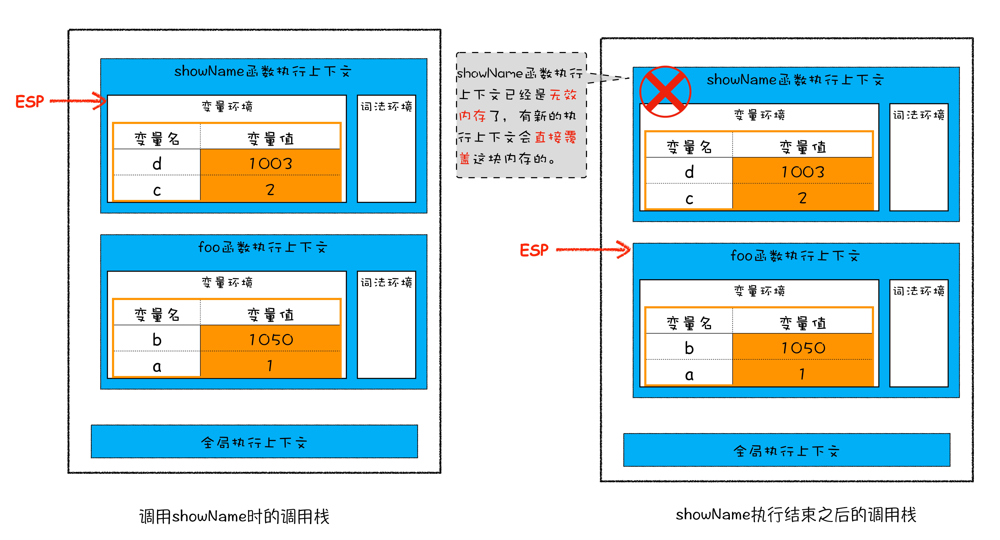
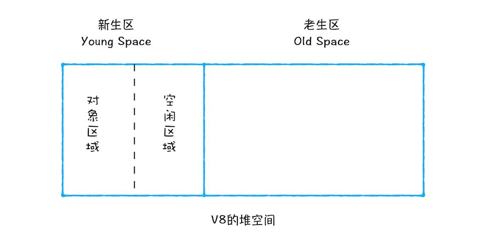
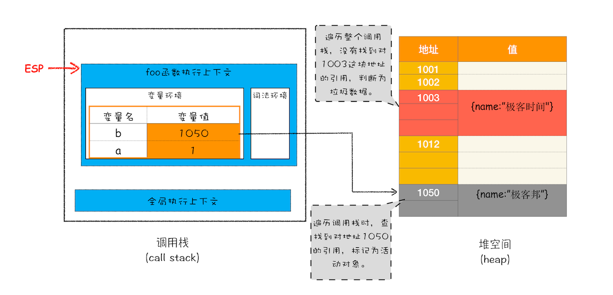
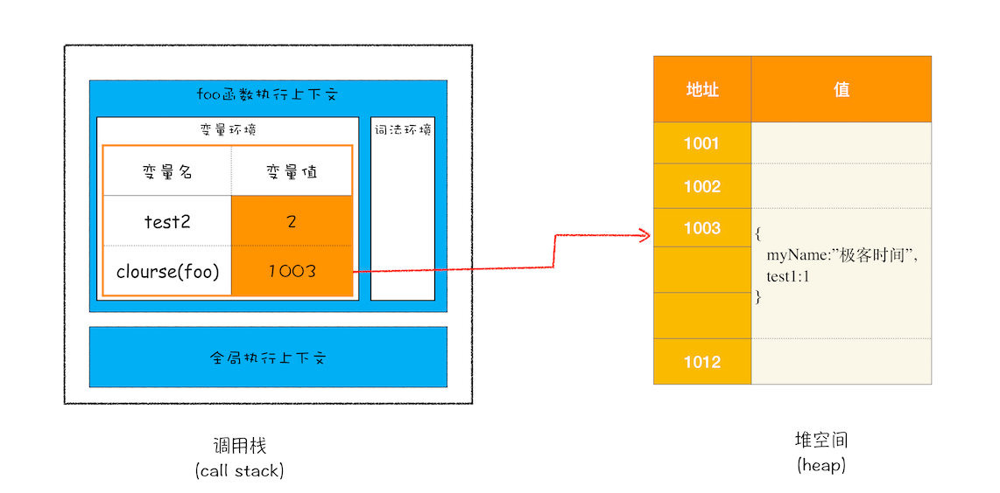
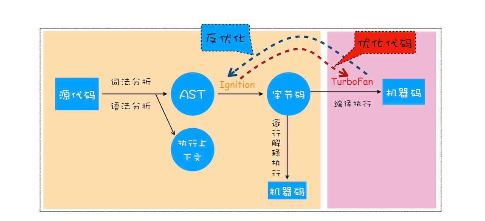

### V8工作原理

1. 在使用之前就需要确认其变量数据类型的称为静态语言, 在运行过程中需要检查数据类型的语言称为动态语
2. 支持隐式类型转换的语言称为弱类型语言，不支持隐式类型转换的语言称为强类型语言

### 内存空间

在 JavaScript 的执行过程中， 主要有三种类型内存空间，分别是代码空间、栈空间和堆空间

原始类型的数据值都是直接保存在“栈”中的，引用类型的值是存放在“堆”中的

#### 调用栈中的数据是如何回收的

从图中可以看出，当 showName 函数执行结束之后，ESP 向下移动到 foo 函数的执行上下文中，上面 showName 的执行上下文虽然保存在栈内存中，但是已经是无效内存了。比如当 foo 函数再次调用另外一个函数时，这块内容会被直接覆盖掉，用来存放另外一个函数的执行上下文。所以说，当一个函数执行结束之后，JavaScript 引擎会通过向下移动 ESP 来销毁该函数保存在栈中的执行上下文。

#### 堆中的数据是如何回收的

##### 代际假说和分代收集
  * 第一个是大部分对象在内存中存在的时间很短，简单来说，就是很多对象
  * 一经分配内存，很快就变得不可访问；第二个是不死的对象，会活得更久


在 V8 中会把堆分为新生代和老生代两个区域，新生代中存放的是生存时间短的对象，老生代中存放的生存时间久的对象。
* 副垃圾回收器，主要负责新生代的垃圾回收。
* 主垃圾回收器，主要负责老生代的垃圾回收。

新生代中用 Scavenge 算法来处理。所谓 Scavenge 算法，是把新生代空间对半划分为两个区域，一半是对象区域，一半是空闲区域，如下图所示：


##### 主垃圾回收器
主垃圾回收器主要负责老生区中的垃圾回收。除了新生区中晋升的对象，一些大的对象会直接被分配到老生区。因此老生区中的对象有两个特点，一个是对象占用空间大，另一个是对象存活时间长

主垃圾回收器是采用标记 - 清除（Mark-Sweep）的算法进行垃圾回收
标记 - 整理（Mark-Compact）

全停顿 增量标记（Incremental Marking）算法

### 再谈闭包

```js
function foo() {
  var myName = '极客时间';
  let test1 = 1;
  const test2 = 2;
  var innerBar = {
    setName: function (newName) {
      myName = newName;
    },
    getName: function () {
      console.log(test1);
      return myName;
    },
  };
  return innerBar;
}
var bar = foo();
bar.setName('极客邦');
bar.getName();
console.log(bar.getName());
```

1. 当 JavaScript 引擎执行到 foo 函数时，首先会编译，并创建一个空执行上下文。
2. 在编译过程中，遇到内部函数 setName，JavaScript 引擎还要对内部函数做一次快速的词法扫描，发现该内部函数引用了 foo 函数中的 myName 变量，由于是内部函数引用了外部函数的变量，所以 JavaScript 引擎判断这是一个闭包，于是在堆空间创建换一个“closure(foo)”的对象（这是一个内部对象，JavaScript 是无法访问的），用来保存 myName 变量。
3. 接着继续扫描到 getName 方法时，发现该函数内部还引用变量 test1，于是 JavaScript 引擎又将 test1 添加到“closure(foo)”对象中。这时候堆中的“closure(foo)”对象中就包含了 myName 和 test1 两个变量了。
4. 由于 test2 并没有被内部函数引用，所以 test2 依然保存在调用栈中。
   
   从上图你可以清晰地看出，当执行到 foo 函数时，闭包就产生了；当 foo 函数执行结束之后，返回的 getName 和 setName 方法都引用“closure(foo)”对象，所以即使 foo 函数退出了，“ closure(foo)”依然被其内部的 getName 和 setName 方法引用。所以在下次调用 bar.setName 或者 bar.getName 时，创建的执行上下文中就包含了“closure(foo)”。

### V8 是如何执行一段 JavaScript 代码的？

#### 编译器和解释器



1. 生成抽象语法树（AST）和执行上下文
   第一阶段是分词（tokenize），又称为词法分析

第二阶段是解析（parse），又称为语法分析

2. 生成字节码
   字节码就是介于 AST 和机器码之间的一种代码。但是与特定类型的机器码无关，字节码需要通过解释器将其转换为机器码后才能执行。

3. 执行代码
   
