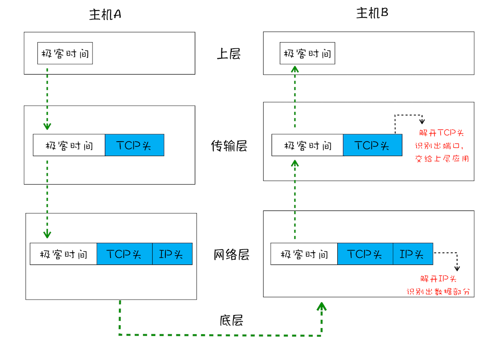
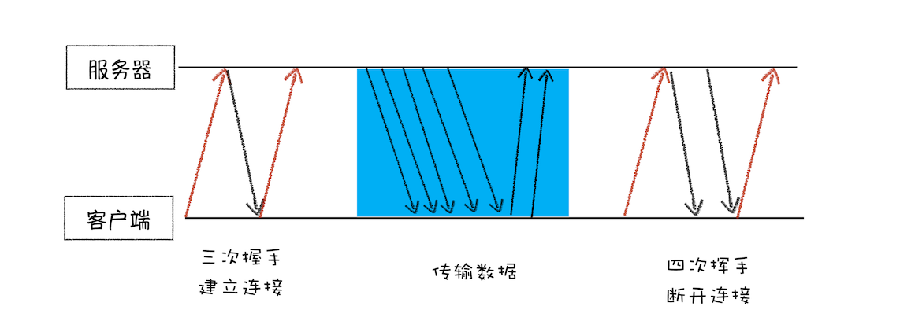
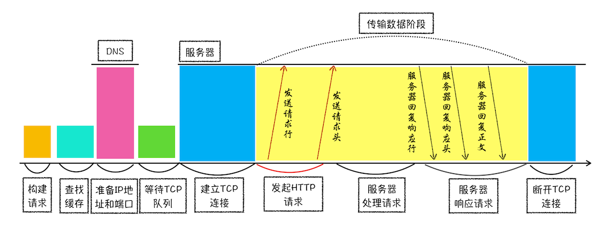
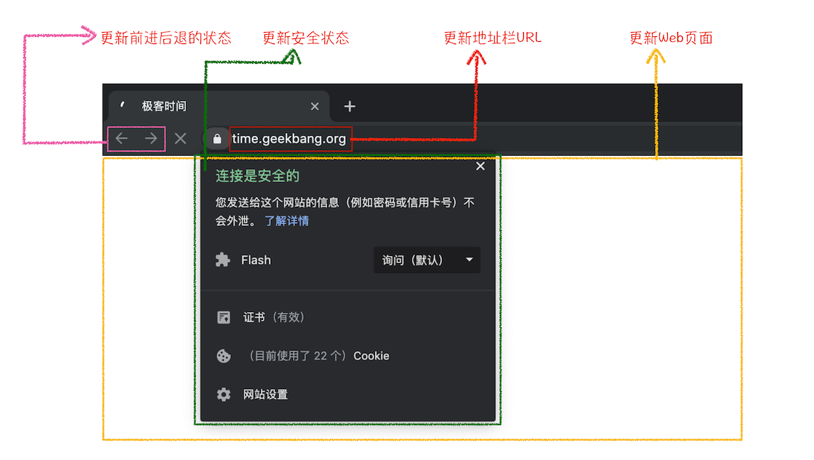

## 宏观看浏览器及导航流程

历史单进程架构

- 不稳定
- 不流畅
- 不安全

### 多进程架构

- 浏览器主进程
  主要负责界面显示、用户交互、子进程管理，同时提供存储等功能
- 网络进程
- GPU 进程
- 渲染进程
  核心任务是将 HTML、CSS 和 JavaScript 转换为用户可以与之交互的网页，排版引擎 Blink 和 JavaScript 引擎 V8 都是运行在该进程中，默认情况下，Chrome 会为每个 Tab 标签创建一个渲染进程。出于安全考虑，渲染进程都是运行在沙箱模式下。
- 插件进程

### 未来面向服务的架构

Chrome 最终要把 UI、数据库、文件、设备、网络等模块重构为基础服务，类似操作系统底层服务，下面是 Chrome“面向服务的架构”的进程模型图：

### TCP 协议

互联网，实际上是一套理念和协议组成的体系架构。其中，协议是一套众所周知的规则和标准，如果各方都同意使用，那么它们之间的通信将变得毫无障碍

1. IP：把数据包送达目的主机
   数据包要在互联网上进行传输，就要符合网际协议（Internet Protocol，简称 IP）标准
   计算机的地址就称为 IP 地址，访问任何网站实际上只是你的计算机向另外一台计算机请求信息

2. UDP：把数据包送达应用程序
UDP 中一个最重要的信息是端口号，端口号其实就是一个数字，每个想访问网络的程序都需要绑定一个端口号。通过端口号 UDP 就能把指定的数据包发送给指定的程序了，所以 IP 通过 IP 地址信息把数据包发送给指定的电脑，而 UDP 通过端口号把数据包分发给正确的程序
UDP 不能保证数据可靠性，但是传输速度却非常快，所以 UDP 会应用在一些关注速度、但不那么严格要求数据完整性的领域，如在线视频、互动游戏等。

3. TCP：把数据完整地送达应用程序
   TCP（Transmission Control Protocol，传输控制协议）是一种面向连接的、可靠的、基于字节流的传输层通信协议

- 对于数据包丢失的情况，TCP 提供重传机制；
- TCP 引入了数据包排序机制，用来保证把乱序的数据包组合成一个完整的文件。
  TCP 下的单个数据包的传输流程
  
  一个完整的 TCP 连接的生命周期包括了“建立连接”“传输数据”和“断开连接”三个阶段。
  

    1. 首先，建立连接阶段。这个阶段是通过“三次握手”来建立客户端和服务器之间的连接。TCP 提供面向连接的通信传输。面向连接是指在数据通信开始之前先做好两端之间的准备工作。所谓三次握手，是指在建立一个 TCP 连接时，客户端和服务器总共要发送三个数据包以确认连接的建立。

    2. 其次，传输数据阶段。在该阶段，接收端需要对每个数据包进行确认操作，也就是接收端在接收到数据包之后，需要发送确认数据包给发送端。所以当发送端发送了一个数据包之后，在规定时间内没有接收到接收端反馈的确认消息，则判断为数据包丢失，并触发发送端的重发机制。同样，一个大的文件在传输过程中会被拆分成很多小的数据包，这些数据包到达接收端后，接收端会按照 TCP 头中的序号为其排序，从而保证组成完整的数据。

    3. 最后，断开连接阶段。数据传输完毕之后，就要终止连接了，涉及到最后一个阶段“四次挥手”来保证双方都能断开连接。

##### 小结
  1. 互联网中的数据是通过数据包来传输的，数据包在传输过程中容易丢失或出错。
  2. IP 负责把数据包送达目的主机。
  3. UDP 负责把数据包送达具体应用。
  4. 而 TCP 保证了数据完整地传输，它的连接可分为三个阶段：建立连接、传输数据和断开连接。

### 缓存
  浏览器端发起 HTTP 请求流程

  1. 构建请求
  2. 查找缓存
  3. 准备 IP 地址和端口
  4. 等待 TCP 队列
  5. 建立 TCP 连接
  6. 发送 HTTP 请求

  服务器端处理 HTTP 请求流程

  1. 返回请求
  2. 断开连接
  3. 重定向
  
### 从输入 URL 到页面展示，这中间发生了什么？

- 浏览器进程主要负责用户交互、子进程管理和文件储存等功能
- 网络进程是面向渲染进程和浏览器进程等提供网络下载功能
- 渲染进程的主要职责是把从网络下载的 HTML、JavaScript、CSS、图片等资源解析为可以显示和交互的页面。因为渲染进程所有的内容都是通过网络获取的，会存在一些恶意代码利用浏览器漏洞对系统进行攻击，所以运行在渲染进程里面的代码是不被信任的。这也是为什么 Chrome 会让渲染进程运行在安全沙箱里，就是为了保证系统的安全。

##### 导航

首先，浏览器进程接收到用户输入的 URL 请求，浏览器进程便将该 URL 转发给网络进程。然后，在网络进程中发起真正的 URL 请求。接着网络进程接收到了响应头数据，便解析响应头数据，并将数据转发给浏览器进程。浏览器进程接收到网络进程的响应头数据之后，发送“提交导航 (CommitNavigation)”消息到渲染进程；渲染进程接收到“提交导航”的消息之后，便开始准备接收 HTML 数据，接收数据的方式是直接和网络进程建立数据管道；最后渲染进程会向浏览器进程“确认提交”，这是告诉浏览器进程：“已经准备好接受和解析页面数据了”。浏览器进程接收到渲染进程“提交文档”的消息之后，便开始移除之前旧的文档，然后更新浏览器进程中的页面状态

#### 从输入 URL 到页面展示

1. 用户输入
2. URL 请求过程
   （1）重定向
   （2）响应数据类型处理

3. 准备渲染进程
   总结来说，打开一个新页面采用的渲染进程策略就是：通常情况下，打开新的页面都会使用单独的渲染进程；如果从 A 页面打开 B 页面，且 A 和 B 都属于同一站点的话，那么 B 页面复用 A 页面的渲染进程；如果是其他情况，浏览器进程则会为 B 创建一个新的渲染进程。

4. 提交文档
   首先当浏览器进程接收到网络进程的响应头数据之后，便向渲染进程发起“提交文档”的消息；渲染进程接收到“提交文档”的消息后，会和网络进程建立传输数据的“管道”；等文档数据传输完成之后，渲染进程会返回“确认提交”的消息给浏览器进程；浏览器进程在收到“确认提交”的消息后，会更新浏览器界面状态，包括了安全状态、地址栏的 URL、前进后退的历史状态，并更新 Web 页面。
   

5. 渲染阶段
